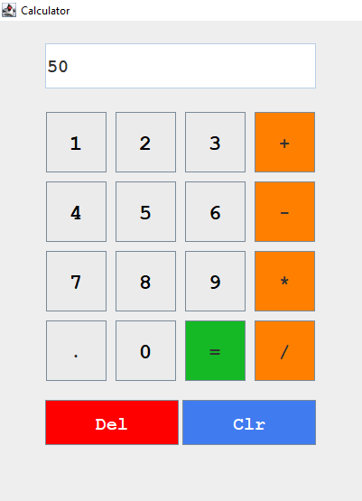

# Java Swing Calculator
Introducing a straightforward and user-friendly calculator application developed using Java Swing for its graphical user interface. 
This calculator offers essential arithmetic operations, including addition, subtraction, multiplication, 
and division, all wrapped in a sleek and professional theme.

## Key Features

1. Perform addition, subtraction, multiplication, and division with ease.
2. Utilize a decimal point for precise calculations.
3. Manage your inputs effortlessly with Clear and Delete buttons.
4. Switch between positive and negative numbers using the Negative button.
5. Enjoy a polished and user-friendly interface design.

## Technologies Utilized

1. Java Swing: Employed for crafting the graphical user interface.
2. Java AWT: Used for fundamental window and widget functionalities.
3. Java Event Handling: Implemented for responsive button actions.
4. Custom Fonts and Colors: Tailored to deliver a professional and visually appealing theme.

## Getting Started

1. Begin by cloning or downloading the repository.
2. Compile and run the Calculator.java file.
3. Start using the calculator for your basic arithmetic computations.

## Screenshots

## Contribution

If you have questions, encounter issues, or wish to propose new features, please don't hesitate 
to open an issue on this repository. We greatly value and appreciate your feedback!

## Acknowledgments

This project draws inspiration from various open-source Java Swing calculator projects and 
strives to offer a straightforward and elegant calculator solution.
